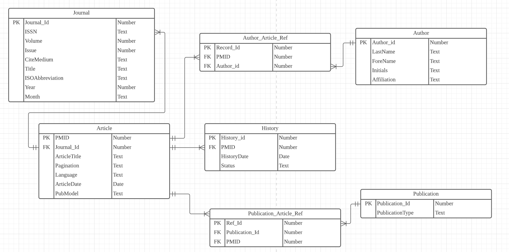
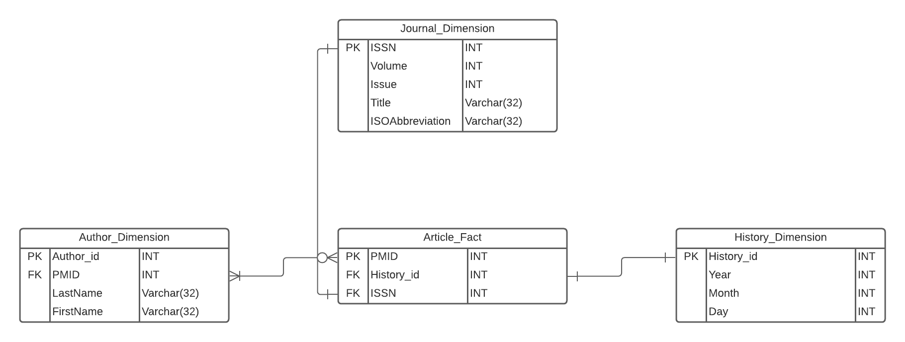
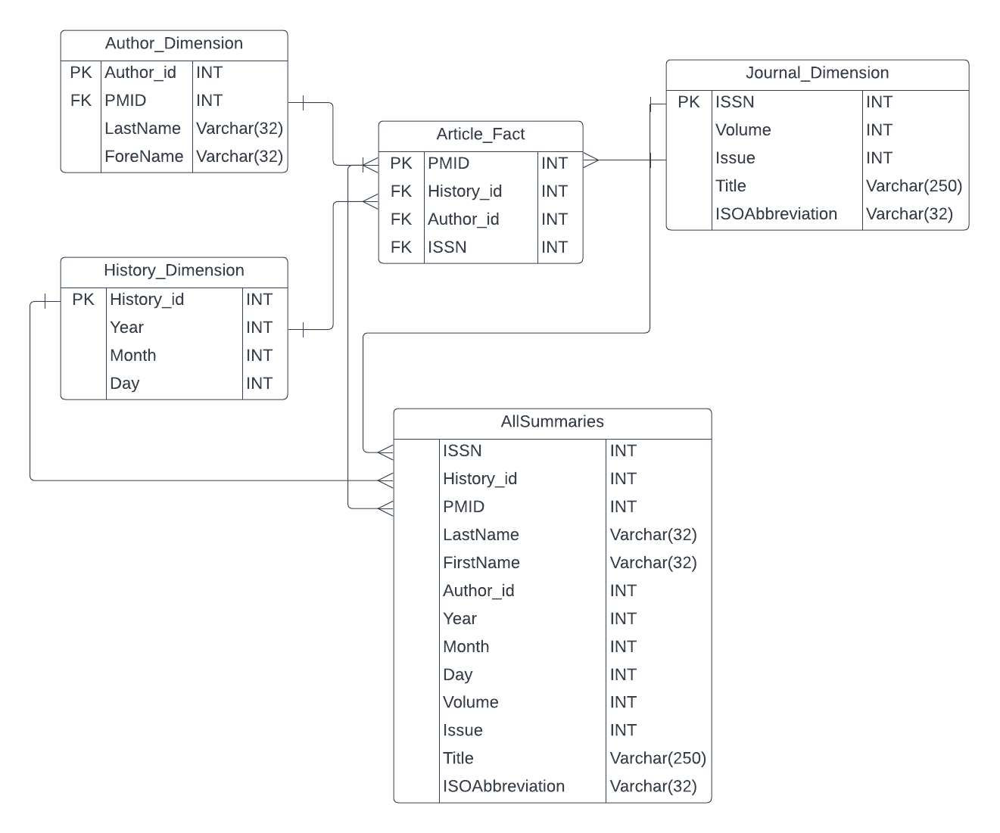

### Part 1.1 Create a normalized relational schema

In the design, we created 5 tables named Journal,Article,History,CopyRight and Author.

[Lucid chart link to ERD](https://lucid.app/lucidchart/d0c79371-862e-4f7c-a26a-675d442d3669/edit?viewport_loc=-3168%2C1190%2C2406%2C1158%2C0_0&invitationId=inv_479f45f2-d4c9-4514-8249-fbaeed3fb174)


### Part 1.2 Realize the Relational Schema in SQLite

First, we start loading library
```{r}
library(XML)
library(RSQLite)
#install.packages("dplyr")
library(dplyr)
#install.packages("sqldf")
library(sqldf)

options(sqldf.driver = "SQLite")

```

Second, we set up the file and path.
```{r }
fn <- "pubmed_sample.xml"
dbfn <- "pubmed.db"
```

Third, we make connection to dataBase and enabling foreign keys.
```{r, include=FALSE}
PADBcon <- dbConnect(RSQLite::SQLite(), dbfn)
dbExecute(PADBcon, "PRAGMA foreign_keys = ON")
```


### Part 1.2 Create table

Because of foreign key in Table Journal and Author which would be used in table Article, Copyright and History, Table Journal and Author should be inserted first and then we creating following tables.

Drop table Author_Article_Ref
```{sql connection = "PADBcon"}
drop table if exists Author_Article_Ref;
```

Drop table Publication_Article_Ref
```{sql connection = "PADBcon"}
drop table if exists Publication_Article_Ref;
```

Drop table History.
```{sql connection = "PADBcon"}
drop table if exists History;
```

Drop table Article.
```{sql connection = "PADBcon"}
drop table if exists Article;
```

Drop table Journal.
```{sql connection = "PADBcon"}
drop table if exists Journal;
```

Drop table Author.
```{sql connection = "PADBcon"}
drop table if exists Author;
```

Drop table Publication
```{sql connection = "PADBcon"}
drop table if exists Publication;
```

Create table Journal
```{sql connection = "PADBcon"}
create table Journal (
  Journal_Id integer PRIMARY KEY AUTOINCREMENT,
  ISSN text,
  Volume integer NOT NULL,
  Issue integer NOT NULL,
  CiteMedium text NOT NULL,
  Title text NOT NULL,
  ISOAbbreviation text NOT NULL,
  Year integer,
  Month Text
);
```

Create table Author
```{sql connection = "PADBcon"}
create table Author (
  Author_Id integer PRIMARY KEY AUTOINCREMENT,
  LastName text NOT NULL,
  ForeName text NOT NULL,
  Initials text NOT NULL,
  Affiliation text
);
```

Create table Article
```{sql connection = "PADBcon"}
create table Article (
  PMID integer,
  Journal_Id integer,
  ArticleTitle text NOT NULL,
  Pagination text,
  Language text NOT NULL,
  ArticleDate date,
  PubModel text NOT NULL,
  primary key (PMID),
  foreign key (Journal_Id) references Journal(Journal_Id)
);
```

Create table History
```{sql connection = "PADBcon"}
create table History (
  History_Id integer PRIMARY KEY AUTOINCREMENT,
  PMID integer,
  HistoryDate date,
  Status text NOT NULL,
  foreign key (PMID) references Article(PMID)
);
```

Create table Author_Article_Ref
```{sql connection = "PADBcon"}
create table Author_Article_Ref (
  Record_Id integer PRIMARY KEY AUTOINCREMENT,
  PMID integer,
  Author_Id integer,
  foreign key (PMID) references Article(PMID),
  foreign key (Author_Id) references Author(Author_Id)
);
```

Create table Publication
```{sql connection = "PADBcon"}
create table Publication (
  Publication_Id integer PRIMARY KEY AUTOINCREMENT,
  PublicationType text
);
```

Create table Publication_Article_Ref
```{sql connection = "PADBcon"}
create table Publication_Article_Ref (
  Ref_Id integer PRIMARY KEY AUTOINCREMENT,
  PMID integer,
  Publication_Id integer,
  foreign key (PMID) references Article(PMID),
  foreign key (Publication_Id) references Publication(Publication_Id)
);
```

### Part 1.3 Extract and transform the data from the XML and then load into the appropriate tables in the database.
```{r}
xmlObj <- xmlParse(fn)
root <- xmlRoot(xmlObj)
numPO <- xmlSize(root)
```

#### Parsing Journals
```{r}
parseJournal <- function (anJournalNode)
{
  # parse the journal into its components
  ISSN <- xmlValue(anJournalNode[[1]])

  journal_issue <- anJournalNode[[2]]

  Volume <- as.numeric(xmlValue(journal_issue[[1]]))
  Issue <- as.numeric(xmlValue(journal_issue[[2]]))
  CiteMedium <- xmlAttrs(journal_issue)[1]

  Title <- xmlValue(anJournalNode[[3]])
  ISOAbbreviation <- xmlValue(anJournalNode[[4]])

  pub_date <- journal_issue[[3]]
  Year <- xmlValue(pub_date[[1]])

  whole <- strsplit(Year, " ")
  if(length(whole[[1]]) == 1){
    Month <- xmlValue(pub_date[[2]])
  }else{
    Year <- whole[[1]][1]
    Month <- whole[[1]][2]
  }
  Year <- as.numeric(Year)
  newJournal.df <- data.frame(ISSN, Volume, Issue, CiteMedium, Title, ISOAbbreviation, Year, Month, stringsAsFactors=FALSE)

  return(newJournal.df)
}
```

#### Creating Journal dataframe
```{r}
Journals <- data.frame (ISSN = character(),
                          Volume = integer(),
                          Issue = integer(),
                          CiteMedium = character(),
                          Title = character(),
                          ISOAbbreviation = character(),
                          Year = integer(),
                          Month = character(),
                          stringsAsFactors=FALSE)

xpathEx <- "//Journal"
journal_nodes <- xpathSApply(xmlObj, xpathEx)
for (i in 1:length(journal_nodes)){
  journal <- journal_nodes[[i]]
  df <- parseJournal(journal)
  join <- intersect(Journals,df)
  if(nrow(join) == 0){
    Journals <- rbind(df,Journals)
  }
}

# Adding primary key
Journals <- tibble::rowid_to_column(Journals, "Journal_Id")

head(Journals)
```

#### Parsing Authors
```{r}
parseAuthor <- function (anAuthorNode)
{
  # parse the author into its components
  LastName <- xmlValue(anAuthorNode[[1]])
  ForeName <- xmlValue(anAuthorNode[[2]])
  Initials <- xmlValue(anAuthorNode[[3]])
  Affiliation <- xmlValue(anAuthorNode[[4]])

  newAuthor.df <- data.frame(LastName, ForeName, Initials, Affiliation, stringsAsFactors=FALSE)

  return(newAuthor.df)
}
```

#### Creating Author dataframe
```{r}
Authors <- data.frame (LastName = character(),
                          ForeName = character(),
                          Initials = character(),
                          Affiliation = character(),
                         stringsAsFactors=FALSE)

xpathEx <- "//Author"
author_nodes <- xpathSApply(xmlObj, xpathEx)
for (i in 1:length(author_nodes)){
  author <- author_nodes[[i]]
  df <- parseAuthor(author)
  join <- intersect(Authors,df)
  if(nrow(join) == 0){
    Authors <- rbind(df,Authors)
  }
}

# Adding primary key
Authors <- tibble::rowid_to_column(Authors, "Author_Id")

head(Authors)
```

#### Parsing Publications
```{r}
parsePublication <- function (anPublicationNode)
{
  # parse the publication into its components
  PublicationType <- xmlValue(anPublicationNode[[1]])

  newPublication.df <- data.frame(PublicationType, stringsAsFactors=FALSE)

  return(newPublication.df)
}
```

#### Creating Publication dataframe
```{r}
Publications <- data.frame (PublicationType = character(),
                         stringsAsFactors=FALSE)

xpathEx <- "//PublicationType"
publication_nodes <- xpathSApply(xmlObj, xpathEx)
for (i in 1:length(publication_nodes)){
  publication <- publication_nodes[[i]]
  df <- parsePublication(publication)
  join <- intersect(Publications,df)
  if(nrow(join) == 0){
    Publications <- rbind(df,Publications)
  }
}

# Adding primary key
Publications <- tibble::rowid_to_column(Publications, "Publication_Id")

head(Publications)
```

#### Parsing Articles
```{r}
parseArticle <- function (PMID, anArticleNode)
{

  # parse the article into its components
  ISSN <- xmlValue(anArticleNode[[1]][[1]])
  Issue <- as.numeric(xmlValue(anArticleNode[[1]][[2]][[2]]))
  Journal_Id <- sqldf(sprintf("Select Journal_id from Journals where ISSN = '%s' and Issue = %i",ISSN,Issue))
  ArticleTitle <- xmlValue(anArticleNode[[2]])
  Pagination <- xmlValue(anArticleNode[[3]][[1]])

  xpathEx <- paste("//Article[../PMID = ",PMID, "]/Language")
  lang <- xpathSApply(anArticleNode, xpathEx)
  Language <- xmlValue(lang)

  xpathEx <- paste("//Article[../PMID = ",PMID, "]/ArticleDate")
  date <- xpathSApply(anArticleNode, xpathEx)
  if(length(xmlValue(date)) != 0){
    ArticleDate <- xmlValue(date)
  } else{
    ArticleDate <- ""
  }

  PubModel <- xmlAttrs(anArticleNode)[1]

  newArticle.df <- data.frame(PMID, Journal_Id, ArticleTitle, Pagination, Language, ArticleDate, PubModel, stringsAsFactors=FALSE)

  return(newArticle.df)
}
```

#### Creating Article dataframe
```{r}
Articles <- data.frame (PMID = integer(),
                        Journal_Id = integer(),
                        ArticleTitle = character(),
                        Pagination = character(),
                        Language = character(),
                        ArticleDate = character(),
                        PubModel = character(),
                        stringsAsFactors=FALSE)

xpathEx <- "//Article | //Article/../PMID"
article_nodes <- xpathSApply(xmlObj, xpathEx)

for (i in 1:xmlSize(article_nodes)){
  if (i %% 2 == 1){
    df <- parseArticle(as.numeric(xmlValue(article_nodes[[i]])), article_nodes[[i+1]])
    join <- intersect(Articles,df)
    if(nrow(join) == 0){
      Articles <- rbind(df,Articles)
    }
  }
}
head(Articles)
```

#### Parsing History
```{r}
parseHistory <- function (PMID, anHistoryNode)
{

  # parse the history into its components
  HistoryDate <- xmlValue(anHistoryNode)
  HistoryDate <- substr(HistoryDate, 1, 8)
  Status <- xmlAttrs(anHistoryNode)[1]

  newHistory.df <- data.frame(PMID, HistoryDate, Status, stringsAsFactors=FALSE)

  return(newHistory.df)
}
```

#### Creating History dataframe
```{r}
Histories <- data.frame (PMID = integer(),
                        HistoryDate = character(),
                        Status = character(),
                        stringsAsFactors=FALSE)

xpathEx <- "//MedlineCitation/PMID"
PMID_nodes <- xpathSApply(xmlObj, xpathEx, xmlValue)

for (i in 1:xmlSize(PMID_nodes)){
  PMID <- PMID_nodes[i]
  xpathEx <- paste("//MedlineCitation[PMID = ", PMID, "]/../PubmedData/History/PubMedPubDate")
  history_nodes <- xpathSApply(xmlObj, xpathEx)
  for(j in 1:length(history_nodes)){
    df <- parseHistory(as.numeric(PMID), history_nodes[[j]])
    join <- intersect(Histories,df)
    if(nrow(join) == 0){
      Histories <- rbind(df,Histories)
    }
  }
}
# Adding primary key
Histories <- tibble::rowid_to_column(Histories, "History_Id")

head(Histories)
```

#### Creating Author_Article_Ref dataframe
```{r}
Temp = data.frame (PMID = integer(),
                    LastName = character(),
                    ForeName = character(),
                    Initials = character(),
                    Affiliation = character(),
                    stringsAsFactors=FALSE)

xpathEx <- "//MedlineCitation/PMID"
PMID_nodes <- xpathSApply(xmlObj, xpathEx, xmlValue)

for (i in 1:xmlSize(PMID_nodes)){
  PMID <- PMID_nodes[i]
  xpathEx <- paste("//MedlineCitation[PMID = ", PMID, "]/Article/AuthorList/Author")
  author_nodes <- xpathSApply(xmlObj, xpathEx)
  for(j in 1:length(author_nodes)){
    df <- parseAuthor(author_nodes[[j]])
    df$PMID = as.numeric(PMID)
    join <- intersect(Temp,df)
    if(nrow(join) == 0){
      Temp <- rbind(df,Temp)
    }
  }
}
Author_Article_Ref <- sqldf("select Temp.PMID, a.Author_id from Temp join Authors a on a.LastName = Temp.LastName and a.ForeName = Temp.ForeName and a.Initials = Temp.Initials and ((a.Affiliation is null and Temp.Affiliation is null) or a.Affiliation = Temp.Affiliation)")

# Adding primary key
Author_Article_Ref <- tibble::rowid_to_column(Author_Article_Ref, "Record_Id")

head(Author_Article_Ref)
```

#### Creating Publication_Article_Ref dataframe
```{r}
Temp = data.frame (PMID = integer(),
                    PublicationType = character(),
                    stringsAsFactors=FALSE)

xpathEx <- "//MedlineCitation/PMID"
PMID_nodes <- xpathSApply(xmlObj, xpathEx, xmlValue)

for (i in 1:xmlSize(PMID_nodes)){
  PMID <- PMID_nodes[i]
  xpathEx <- paste("//MedlineCitation[PMID = ", PMID, "]/Article/PublicationTypeList/PublicationType")
  publication_nodes <- xpathSApply(xmlObj, xpathEx)
  for(j in 1:length(publication_nodes)){
    df <- parsePublication(publication_nodes[[j]])
    df$PMID = as.numeric(PMID)
    join <- intersect(Temp,df)
    if(nrow(join) == 0){
      Temp <- rbind(df,Temp)
    }
  }
}
Publication_Article_Ref <- sqldf("select Temp.PMID, p.Publication_Id from Temp join Publications p on p.PublicationType = Temp.PublicationType")

# Adding primary key
Publication_Article_Ref <- tibble::rowid_to_column(Publication_Article_Ref, "Ref_Id")

head(Publication_Article_Ref)
```

#### Writing data to Tables
```{r}
success <- dbWriteTable(PADBcon, "Journal", Journals, append = T, row.names = FALSE)
success <- dbWriteTable(PADBcon, "Author", Authors, append = T, row.names = FALSE)
success <- dbWriteTable(PADBcon, "Publication", Publications, append = T, row.names = FALSE)
success <- dbWriteTable(PADBcon, "Article", Articles, append = T, row.names = FALSE)
success <- dbWriteTable(PADBcon, "History", Histories, append = T, row.names = FALSE)
success <- dbWriteTable(PADBcon, "Author_Article_Ref", Author_Article_Ref, append = T, row.names = FALSE)
success <- dbWriteTable(PADBcon, "Publication_Article_Ref", Publication_Article_Ref, append = T, row.names = FALSE)
```


### Part 2

### Part 2.1 Create and populate a star schema with dimension and transaction fact tables.



```{sql connection = "PADBcon"}
DROP TABLE IF EXISTS Journal_Dimension
```

```{sql connection = "PADBcon"}
DROP TABLE IF EXISTS Author_Dimension
```

```{sql connection = "PADBcon"}
DROP TABLE IF EXISTS History_Dimension
```

```{sql connection = "PADBcon"}
DROP TABLE IF EXISTS Article_fact
```

```{sql connection = "PADBcon"}
CREATE TABLE Author_Dimension (
  Author_id INT,
  PMID INT,
  LastName VARCHAR(32),
  ForeName VARCHAR(32),
  PRIMARY KEY (Author_id)
  FOREIGN KEY (PMID) REFERENCES PubMed_Article(PMID)
);
```

```{sql connection = "PADBcon"}
CREATE TABLE History_Dimension (
  History_id INT NOT NULL,
  Year INT,
  Month INT,
  Day INT,
  PRIMARY KEY (History_id)
);
```

```{sql connection = "PADBcon"}
CREATE TABLE Article_Fact (
  PMID INT,
  History_id INT,
  Author_id INT,
  ISSN INT,
  PRIMARY KEY (PMID),
  FOREIGN KEY (PMID) REFERENCES Author(PMID),
  FOREIGN KEY (History_id) REFERENCES History(History_id),
  FOREIGN KEY (Author_id) REFERENCES Author(Author_id),
  FOREIGN KEY (ISSN) REFERENCES Journal(ISSN)
);
```

```{sql connection = "PADBcon"}
CREATE TABLE Journal_Dimension (
  ISSN INT,
  Volume INT,
  Issue INT,
  Title VARCHAR(250),
  ISOAbbreviation VARCHAR(32),
  PRIMARY KEY (ISSN)
);
```


Transform data before loading it into fact and summary tables
```{r}
df.Journal <- "create"
df.PubMed_Article <- "make"
df.History <- "start"


xpathEx <- "//ISSN"
df.Journal$ISSN <- xpathSApply(xmlObj,xpathEx,xmlValue)

xpathEx <- "//Volume"
df.Journal$Volume <- xpathSApply(xmlObj,xpathEx,xmlValue)

xpathEx <- "//Issue"
df.Journal$Issue <- xpathSApply(xmlObj,xpathEx,xmlValue)

xpathEx <- "//Journal/Title"
df.Journal$Title <- xpathSApply(xmlObj,xpathEx, xmlValue)

xpathEx <- "//Journal/ISOAbbreviation"
df.Journal$ISOAbbreviation <- xpathSApply(xmlObj,xpathEx, xmlValue)

df.Journal[1] <- NULL
df.Journal_convert <- as.data.frame(df.Journal)

xpathEx <- "//History/PubMedPubDate[@PubStatus='pubmed']/Year"
df.History$Year <- xpathSApply(xmlObj,xpathEx, xmlValue)

xpathEx <- "//History/PubMedPubDate[@PubStatus='pubmed']/Month"
df.History$Month <- xpathSApply(xmlObj,xpathEx, xmlValue)

xpathEx <- "//History/PubMedPubDate[@PubStatus='pubmed']/Day"
df.History$Day <- xpathSApply(xmlObj,xpathEx, xmlValue)
```


```{r}
df.History[1] <- NULL
df.History_convert <- as.data.frame(df.History)
n.History_convert <- nrow(df.History_convert)
df.History_convert$History_id <- seq(1,n.History_convert)
df.History_convert$History_id
df.History_convert


xpathEx <- "//MedlineCitation/PMID"
PMID <- xpathSApply(xmlObj,xpathEx, xmlValue)
```


```{r}
df.PubMed_Article$ISSN <- df.Journal$ISSN
df.PubMed_Article$History_id <- df.History_convert$History_id
df.PubMed_Article$PMID <- PMID

df.Journal$ISSN

```

```{r}
df.PubMed_Article_convert <- as.data.frame(df.PubMed_Article[c("ISSN", "History_id", "PMID")])
df.PubMed_Article_convert


xpathEx <- "//MedlineCitation[PMID='23874253']/Article/AuthorList/Author/LastName"
Author_last <- xpathSApply(xmlObj, xpathEx, xmlValue)
Author_last


df.Author_total <- data.frame()
df.Author_total

datalist = list()

```


```{r}
for (i in 1:19) {
  df.Author <- "trial"
  x <- paste0("//MedlineCitation[PMID='",as.numeric(PMID[i]),"' ]/Article/AuthorList/Author/LastName")
  y <- paste0("//MedlineCitation[PMID='",as.numeric(PMID[i]),"' ]/Article/AuthorList/Author/ForeName")
  last_name <- xpathSApply(xmlObj, x, xmlValue)
  first_name <- xpathSApply(xmlObj, y, xmlValue)

  df.Author$LastName <- last_name
  df.Author$FirstName <- first_name
  for (x in 1:length(last_name)) {df.Author$PMID[x] <- PMID[i]}
  df.Author_dim <- as.data.frame(df.Author)
  datalist[[i]] <- df.Author_dim
}
df.Author_total <- do.call(rbind, datalist)
df.Author_total[1] <- NULL


df.Author_Unique <- df.Author_total[1:2] %>%
  unique()
df.Author_Unique$Author_id <- seq(1, nrow(df.Author_Unique))
```

```{r linkFKs}
for (r in 1:nrow(df.Author_total)) {
  a <- df.Author_Unique$Author_id[which
                               (df.Author_Unique$LastName ==
                                   df.Author_total$LastName[r] &
                                   df.Author_Unique$FirstName ==
                                   df.Author_total$FirstName[r]) ]

  df.Author_total$Author_id[r] <- a

}
```


Populate the said Fact and Summary Tables
```{r}
dbWriteTable(PADBcon, "Author_Dimension", df.Author_total, overwrite = T)
```
```{r}
dbWriteTable(PADBcon, "Article_Fact", df.PubMed_Article_convert, overwrite = T)
```
```{r}
dbWriteTable(PADBcon, "History_Dimension", df.History_convert, overwrite = T)
```
```{r}
dbWriteTable(PADBcon, "Journal_Dimension", df.Journal_convert, overwrite = T)
```

```{sql connection = "PADBcon"}
SELECT * FROM Author_Dimension;
```

```{sql connection = "PADBcon"}

SELECT * FROM Article_Fact;
```
```{sql connection = "PADBcon"}

SELECT * FROM History_Dimension;
```
```{sql connection = "PADBcon"}

SELECT * FROM Journal_Dimension;
```


### Part 2.2 Create and populate a summary fact table.



```{sql connection=PADBcon}
DROP TABLE IF EXISTS AllSummaries
```

```{sql connection=PADBcon}
CREATE TABLE temp AS SELECT * from Article_Fact JOIN Author_Dimension ON Article_Fact.PMID = Author_Dimension.PMID JOIN History_Dimension ON History_Dimension.History_id = Article_Fact.History_id JOIN Journal_Dimension ON Journal_Dimension.ISSN = Article_Fact.ISSN
```

```{sql connection=PADBcon}
CREATE TABLE AllSummaries AS SELECT ISSN, History_id, PMID, LastName, FirstName, Author_id, Year, Month, Day, Volume, Issue, Title, ISOAbbreviation FROM temp
```

```{r}
df.AllSummaries <- dbGetQuery(PADBcon, "SELECT ISSN, History_id, PMID, LastName, FirstName, Author_id, Year, Month, Day, Volume, Issue, Title, ISOAbbreviation FROM temp")
df.AllSummaries$Month <- as.integer(df.AllSummaries$Month)
df.AllSummaries$Year <- as.integer(df.AllSummaries$Year)
df.AllSummaries
```

```{r}
dbWriteTable(dbcon, "AllSummaries", df.AllSummaries, overwrite = T)
```

# Journal SUMMARY QUERY
```{r}
df.Journal_summ <- dbGetQuery(PADBcon, "SELECT Year, CASE WHEN Month <= 3 THEN '1' WHEN Month >= 4 AND Month <= 6 THEN '2' WHEN Month >= 7 AND Month <= 9 THEN '3' WHEN Month >= 10 THEN '4' END AS Quarter, ISSN, Title, count (DISTINCT PMID) AS NumArticles FROM AllSummaries GROUP BY Title ORDER BY Quarter")
dbWriteTable(PADBcon, "Journal_Summary", df.Journal_summ, overwrite = T)
```


# Author Summary Table
```{r}
df.Author_summ <- dbGetQuery(PADBcon, "SELECT Year, CASE WHEN Month <= 3 THEN '1' WHEN Month >= 4 AND Month <= 6 THEN '2' WHEN Month >= 7 AND Month <= 9 THEN '3' WHEN Month >= 10 THEN '4' END AS Quarter, FirstName, LastName, Author_id, count(DISTINCT PMID) AS NumArticles FROM AllSummaries GROUP BY LastName ORDER BY Author_id")
dbWriteTable(PADBcon, "Author_Summary", df.Author_summ, overwrite = T)
```


### Part 3.1 Write queries using your data warehouse to explore whether the publications show a seasonal pattern.

```{sql connection = "PADBcon"}

SELECT count(*)as count, Quarter
            from (SELECT *, CASE when Month in (1,2,3) AND Year in(2011) then '2011_Q1'
            when Month in (4,5,6) AND Year in (2011) then '2011_Q2'
            when Month in (7,8,9) AND Year in (2011) then '2011_Q3'
            when Month in (10,11,12) AND Year in (2011) then '2011_Q4'
            when Month in (1,2,3) AND Year in(2012) then '2012_Q1'
            when Month in (4,5,6) AND Year in (2012) then '2012_Q2'
            when Month in (7,8,9) AND Year in (2012) then '2012_Q3'
            when Month in (10,11,12) AND Year in (2012) then '2012_Q4'
            when Month in (1,2,3) AND Year in(2013) then '2013_Q1'
            when Month in (4,5,6) AND Year in (2013) then '2013_Q2'
            when Month in (7,8,9) AND Year in (2013) then '2013_Q3'
            when Month in (10,11,12) AND Year in (2013) then '2013_Q4'
            end as Quarter from History_Dimension)
            as  History_Dimension  group by Quarter
```


```{r}
sql <- "SELECT count(*)as count, Quarter
            from (SELECT *, CASE when Month in (1,2,3) AND Year in(2011) then '2011_Q1'
            when Month in (4,5,6) AND Year in (2011) then '2011_Q2'
            when Month in (7,8,9) AND Year in (2011) then '2011_Q3'
            when Month in (10,11,12) AND Year in (2011) then '2011_Q4'
            when Month in (1,2,3) AND Year in(2012) then '2012_Q1'
            when Month in (4,5,6) AND Year in (2012) then '2012_Q2'
            when Month in (7,8,9) AND Year in (2012) then '2012_Q3'
            when Month in (10,11,12) AND Year in (2012) then '2012_Q4'
            when Month in (1,2,3) AND Year in(2013) then '2013_Q1'
            when Month in (4,5,6) AND Year in (2013) then '2013_Q2'
            when Month in (7,8,9) AND Year in (2013) then '2013_Q3'
            when Month in (10,11,12) AND Year in (2013) then '2013_Q4'
            end as Quarter from History_Dimension)
            as  History_Dimension  group by Quarter"
df1 <-dbGetQuery(PADBcon,sql)
df1

```

```{r}
library(dplyr)

df1 = df1 %>% add_row(Quarter='2011_Q2',count = 0, .before = 2)
df1 = df1 %>% add_row(Quarter='2013_Q2',count = 0, .before = 9)
df1 = df1 %>% add_row(Quarter='2013_Q1',count = 0, .before = 9)
df1
```

```{r}
library(ggplot2)

ggplot(data=df1, aes(x=Quarter, y=count, group=1)) +
  geom_line()+
  geom_point(color='red')+labs(title="Number of journal publications for each quarter from 2011-2013")
```


```{sql connection = "PADBcon"}

SELECT count(*)as count, Quarter
            from (SELECT *, CASE when Month in (1,2,3)  then 'Q1'
            when Month in (4,5,6)  then 'Q2'
            when Month in (7,8,9)  then 'Q3'
            when Month in (10,11,12)  then 'Q4'
            end as Quarter from History_Dimension)
            as  History_Dimension  group by Quarter
```

```{r}
sql <- "SELECT count(*)as count, Quarter
            from (SELECT *, CASE when Month in (1,2,3)  then 'Q1'
            when Month in (4,5,6)  then 'Q2'
            when Month in (7,8,9)  then 'Q3'
            when Month in (10,11,12)  then 'Q4'
            end as Quarter from History_Dimension)
            as  History_Dimension  group by Quarter"

df3 <-dbGetQuery(PADBcon,sql)

ggplot(df3,aes(Quarter,count, group=1))+geom_point(color='red')+geom_line()+labs(title="Sum of journal publications by quarter")
```


Closing DB connection
```{r}
dbDisconnect(PADBcon)
```